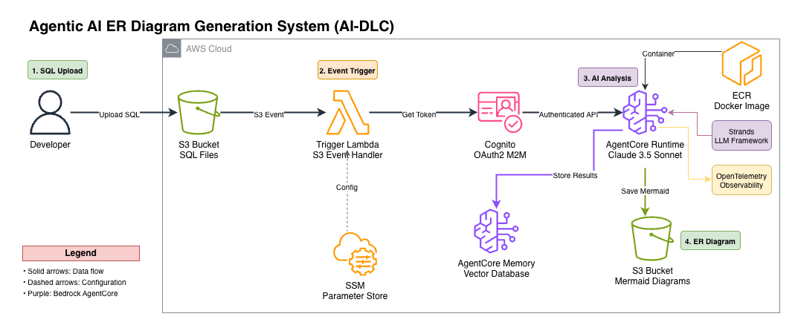
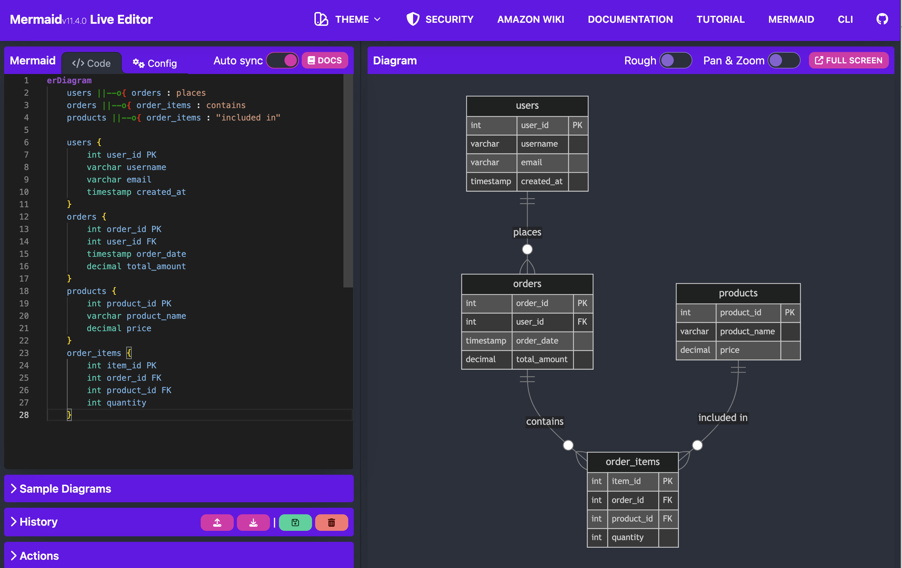

# SQL to ER Diagram Generator

Generates Mermaid ER diagrams from SQL schema files using AWS Bedrock AgentCore.

## Architecture



## Sample Output



## What's Working

1. ✅ Cognito OAuth (deployed)
2. ✅ AgentCore Memory (deployed)
3. ✅ AgentCore Runtime (deployed and tested)
4. ✅ Trigger Lambda (deployed - triggers on S3 SQL file uploads)

## Project Structure

```text
├── deploy/                        # Deployment scripts (run from project root)
│   ├── deploy-cognito-auth.py     # Creates Cognito User Pool and M2M OAuth credentials
│   ├── deploy-agentcore-memory.py # Deploys AgentCore Memory resource
│   ├── deploy-erdiag-agent.py     # Builds container, deploys AgentCore Runtime
│   ├── deploy-trigger-lambda.py   # Creates Lambda function and S3 trigger
│   └── cleanup.py                 # Tears down all AWS resources
├── src/                           # Runtime source code
│   ├── erdiag-agent.py            # Agent: parses SQL and generates Mermaid ER diagrams
│   └── trigger-lambda.py          # Lambda handler: reads SQL from S3, calls AgentCore
├── assets/                        # Architecture diagrams and sample output images
├── samples/                       # Sample Mermaid output files
└── requirements.txt               # Python dependencies for local dev and deployment
```

## Prerequisites

- Python 3.13
- Docker (running locally — used to build the agent container image for `linux/arm64`)
- AWS CLI installed and configured with credentials and sufficient permissions:
  - Cognito, SSM, ECR, Bedrock AgentCore, IAM, Lambda, S3, STS
  - [Install the AWS CLI](https://docs.aws.amazon.com/cli/v1/userguide/cli-chap-install.html)
  - [Authenticate using IAM user credentials](https://docs.aws.amazon.com/cli/latest/userguide/cli-authentication-user.html)
- Bedrock model access: enable `claude-sonnet-4-6` in `us-west-2` via the AWS Console

## Setup

```bash
# Create and activate a virtual environment
python3.13 -m venv .venv
source .venv/bin/activate

# Install dependencies
pip install -r requirements.txt
```

All deploy and cleanup scripts use `boto3` and inherit credentials from the environment. Prefix every command with `AWS_PROFILE=agent` to use the correct AWS profile:

```bash
export AWS_PROFILE=agent
```

Or prefix each command individually as shown in the sections below.

## Deployment Order

### 1. Cognito OAuth

```bash
AWS_PROFILE=agent python3.13 deploy/deploy-cognito-auth.py
```

Creates Cognito User Pool with M2M client credentials flow. Stores client ID, secret, and token URLs in SSM Parameter Store under `/app/erdiagfromsql/agentcore/`.

Wait 10-15 min for DNS propagation before proceeding.

### 2. AgentCore Memory

```bash
AWS_PROFILE=agent python3.13 deploy/deploy-agentcore-memory.py
```

Creates AgentCore Memory with 90-day expiry for storing SQL analysis context. Enables semantic search, summaries, and user preferences. Takes 2-3 minutes to provision.

### 3. AgentCore Runtime

```bash
AWS_PROFILE=agent python3.13 deploy/deploy-erdiag-agent.py --s3-bucket <your-s3-bucket-name>
```

Example:

```bash
AWS_PROFILE=agent python3.13 deploy/deploy-erdiag-agent.py --s3-bucket my-erdiagram-bucket
```

Builds a Docker image, pushes it to ECR, and deploys it as an AgentCore Runtime. The agent:

- Parses SQL DDL statements (CREATE TABLE, constraints, foreign keys)
- Generates Mermaid ER diagram syntax
- Saves `.mmd` files to `s3://<bucket>/erdiags/`

After deployment the script sends a test SQL payload. On success you will see the below text:

```text
SQL Analysis - Status Code: 200
✅ SQL analysis completed successfully!
📋 Action: CREATE
📋 Tables: 4
```

**To redeploy after code changes**, use the `--rebuild` flag to force a fresh Docker image build:

```bash
AWS_PROFILE=agent python3.13 deploy/deploy-erdiag-agent.py --s3-bucket <your-s3-bucket-name> --rebuild
```

**To update the LLM model after deployment, run the below command:**

```bash
AWS_PROFILE=agent python3.13 deploy/deploy-erdiag-agent.py --update-model <model-id>
```

### 4. Trigger Lambda

```bash
AWS_PROFILE=agent python3.13 deploy/deploy-trigger-lambda.py --s3-bucket <your-s3-bucket-name> --bucket-region <region>
```

Example:

```bash
AWS_PROFILE=agent python3.13 deploy/deploy-trigger-lambda.py --s3-bucket my-erdiagram-bucket --bucket-region us-west-2
```

Creates a Lambda function that:

- Triggers when `.sql` files are uploaded to the specified S3 bucket
- Authenticates via Cognito OAuth (client credentials flow)
- Calls AgentCore runtime to generate Mermaid ER diagrams
- Includes exponential backoff retry for AgentCore rate limits (4 req/min)

## Testing End-to-End

Upload any `.sql` file to your S3 bucket:

```bash
AWS_PROFILE=agent aws s3 cp my-schema.sql s3://<your-bucket>/
```

The Lambda triggers automatically. Check for the generated diagram:

```bash
AWS_PROFILE=agent aws s3 ls s3://<your-bucket>/erdiags/
```

You should see a `.mmd` file appear within ~30 seconds.

## Verifying the Mermaid Diagram

### Automatic verification (during deployment)

`deploy/deploy-erdiag-agent.py` runs a test SQL payload after the runtime is ready. If the agent produces a diagram, the script:

1. Downloads the `.mmd` file from `s3://<bucket>/erdiags/` to the current directory.
2. Prints the full diagram content to the terminal.
3. Opens [https://mermaid.live/edit](https://mermaid.live/edit) in your default browser.

Copy the printed diagram content and paste it into the Mermaid Live editor to visualize the ER diagram.

### Manual verification

If you want to verify a diagram independently after an end-to-end test:

**Step 1 — Download the file from S3:**

```bash
# List generated diagrams
aws s3 ls s3://<your-bucket>/erdiags/ --profile agent

# Download the latest file (replace filename as shown in the listing)
aws s3 cp s3://<your-bucket>/erdiags/<filename>.mmd . --profile agent
```

**Step 2 — View the content:**

```bash
cat <filename>.mmd
```

**Step 3 — Visualize in Mermaid Live:**

1. Open [https://mermaid.live/edit](https://mermaid.live/edit) in your browser.
2. Clear the default content in the editor.
3. Paste the contents of the `.mmd` file.
4. The ER diagram renders instantly in the preview panel on the right.

## Cleanup

### Delete all AWS resources

To tear down every resource created by the deploy scripts:

> **Caution:** Always run with `--dry-run` first to confirm what will be deleted before making any changes. This operation is irreversible.

```bash
# Preview what would be deleted (no changes made)
AWS_PROFILE=agent python3.13 deploy/cleanup.py --s3-bucket <your-bucket-name> --dry-run

# Delete all resources (keeps the S3 bucket)
AWS_PROFILE=agent python3.13 deploy/cleanup.py --s3-bucket <your-bucket-name>

# Delete all resources AND empty/delete the S3 bucket
AWS_PROFILE=agent python3.13 deploy/cleanup.py --s3-bucket <your-bucket-name> --delete-bucket
```

Resources removed (in order):

1. S3 bucket Lambda trigger notification
2. Lambda function (`erdiagfromsql-trigger-lambda`) + IAM role
3. AgentCore Runtime
4. ECR repository (`erdiagfromsql-analysis-agent`) and all images
5. AgentCore Runtime IAM role and policies
6. AgentCore Memory
7. AgentCore OAuth2 credential provider
8. Cognito User Pool domain and User Pool
9. All SSM parameters under `/app/erdiagfromsql/agentcore/`
10. S3 bucket contents and bucket _(only with `--delete-bucket`)_

### Deactivate virtual environment

After cleanup is complete, deactivate the virtual environment:

```bash
deactivate
```

## Notes

- All commands require the `agent` AWS profile. Prefix with `AWS_PROFILE=agent` or run `export AWS_PROFILE=agent` once per session.
- All deploy scripts default to `us-west-2`. The region is hardcoded at the top of each script.
- All configuration is stored in SSM Parameter Store under `/app/erdiagfromsql/agentcore/`.
- The `--rebuild` flag on `deploy/deploy-erdiag-agent.py` is required any time `src/erdiag-agent.py` is changed, to force a fresh Docker image build instead of reusing the cached ECR image.
- In real-world scenarios, SQL files are typically checked into a code repository (GitLab or GitHub) and uploaded to S3 automatically via a GitLab pipeline job or GitHub Actions workflow—rather than developers manually uploading files as shown in this architecture. This CI/CD integration step is out of scope for this aws-samples project and will depend on the code repository tooling used in your organization.
