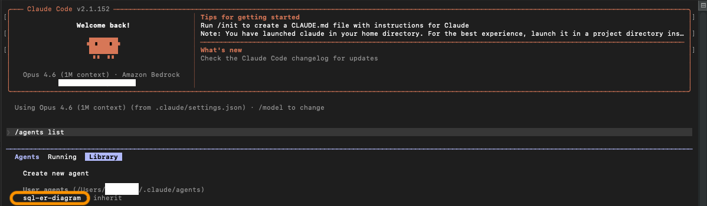

# SQL to ER Diagram — Claude Code Subagent

A Claude Code subagent that generates Mermaid ER diagrams from SQL schema files. Based on the [aws-samples repo](https://github.com/aws-samples/sample-to-create-mermaid-entity-diagrams-from-sql-using-agentic-ai-on-agentcore) which uses Amazon Bedrock AgentCore — adapted here to run locally as a prompt-driven Claude Code subagent.

## Setup

Copy the subagent file to your Claude Code agents directory:

```bash
# User scope — available in all your projects
cp sql-er-diagram.md ~/.claude/agents/

# OR project scope — checked into a specific repo for your team
mkdir -p .claude/agents && cp sql-er-diagram.md .claude/agents/
```

Subagents loaded from disk require a session restart. Then verify it's registered:

```
/agents
```

You should see `sql-er-diagram` in the Library tab.

## Usage



### Automatic delegation

Claude delegates automatically based on the subagent's `description`. Just ask:

```
Generate an ER diagram from samples/ecommerce.sql
```

### Explicit invocation

@-mention the subagent to guarantee it runs:

```
@agent-sql-er-diagram generate a diagram from samples/hr-management.sql
```

Or name it in natural language:

```
Use the sql-er-diagram subagent on samples/ecommerce.sql
```

### Run the whole session as this agent

```bash
claude --agent sql-er-diagram
```

### Paste SQL inline

```
Generate an ER diagram from this:
CREATE TABLE users (id INT PRIMARY KEY, name VARCHAR(100));
CREATE TABLE orders (id INT PRIMARY KEY, user_id INT, FOREIGN KEY (user_id) REFERENCES users(id));
```

## What It Does

1. Reads SQL DDL (CREATE TABLE statements)
2. Identifies tables, columns, data types, and constraints
3. Detects relationships via FOREIGN KEY declarations
4. Outputs a valid Mermaid `erDiagram` block
5. Saves the `.mmd` file to a user-specified path (defaults to `~/`)

## Project Structure

```
sql-agent/
├── sql-er-diagram.md       # Claude Code subagent (copy to ~/.claude/agents/)
├── README.md
└── samples/
    ├── ecommerce.sql       # 5-table e-commerce schema
    └── hr-management.sql   # 5-table HR schema with self-referencing FK
```

## Subagent Configuration

The `sql-er-diagram.md` frontmatter defines:

| Field | Value | Purpose |
|-------|-------|---------|
| `name` | `sql-er-diagram` | Unique identifier used for invocation |
| `description` | ER diagram generator | Tells Claude when to delegate |
| `tools` | `Read, Write, Glob, Grep` | Restricts the subagent to read SQL and write `.mmd` files |
| `model` | `inherit` | Uses the same model as the main conversation |

## Sample Files

- `samples/ecommerce.sql` — customers, products, orders, order_items, reviews
- `samples/hr-management.sql` — departments, employees, projects, project_assignments, timesheets (includes self-referencing FK on employees.manager_id)

## Visualizing Output

Paste the generated Mermaid diagram into [mermaid.live/edit](https://mermaid.live/edit) to render it.

## Uninstall

```bash
rm ~/.claude/agents/sql-er-diagram.md   # user scope
rm .claude/agents/sql-er-diagram.md     # project scope
```
