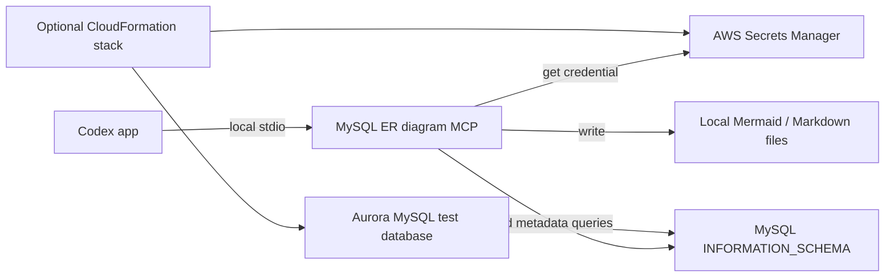

# Codex MySQL Schema Visibility and ER Diagram Toolkit

Generate current Mermaid ER diagrams from an authorized dev/test MySQL or
Aurora MySQL database without querying table row data.

The project provides a local stdio MCP server for Codex. It runs fixed queries
against `INFORMATION_SCHEMA`, summarizes the schema, and writes Mermaid or
Markdown files that developers can inspect and commit alongside their code.

> [!IMPORTANT]
> Use this project only with an authorized dev/test database and a dedicated
> read-only credential. The optional CloudFormation stack is intended for demos
> and testing, not production.

## What It Does

The MCP server exposes three tools:

| Tool | Result |
| --- | --- |
| `schema_summary` | Returns table, column, index, and foreign-key counts |
| `generate_er_markdown` | Writes a Markdown file containing a Mermaid diagram |
| `generate_mermaid` | Writes a standalone Mermaid `.mmd` file |

See the checked-in example outputs:

- [`er-diagrams/schema-er.md`](er-diagrams/schema-er.md)
- [`er-diagrams/schema-er.mmd`](er-diagrams/schema-er.mmd)

## Architecture



The optional stack creates Amazon Aurora MySQL compatible database, generates credentials, a read-only
user, and three related sample tables. You do not need the stack when you
already have an authorized dev/test database.

## Prerequisites

For the local MCP server:

- Codex desktop app
- Python 3.11 or newer
- [`uv`](https://docs.astral.sh/uv/) so `uvx` is available
- network access to the MySQL or Aurora endpoint
- an authorized read-only database credential
- an Amazon RDS CA bundle for TLS verification
- AWS credentials with `secretsmanager:GetSecretValue` when using Secrets Manager

For the optional Aurora test stack:

- AWS CLI configured with a profile
- permission to create CloudFormation, IAM, VPC endpoint, RDS, Lambda,
  Secrets Manager, and CloudWatch resources
- a default VPC with public subnets in at least two Availability Zones
- `curl`, `zip`, Python, and `pip`

The test stack creates billable AWS resources. Its database is publicly
accessible but restricted by a security group to the bootstrap Lambda and a
detected desktop `/24` egress range.

## Quick Start With an Existing Database

This is the recommended path when your team already has a dev/test MySQL or
Aurora database.

### 1. Install `uv`

macOS or Linux:

```sh
curl -LsSf https://astral.sh/uv/install.sh | sh
```

Windows PowerShell:

```powershell
powershell -ExecutionPolicy ByPass -c "irm https://astral.sh/uv/install.ps1 | iex"
```

### 2. Configure the Codex MCP server

Add the following entry to `~/.codex/config.toml`. Replace every placeholder
with a real value:

```toml
[mcp_servers.mysql-er-diagram]
command = "uvx"
args = [
    "--from",
    "<PROJECT_ROOT>/mcp/mysql-er-diagram",
    "mysql-er-diagram-mcp",
]

[mcp_servers.mysql-er-diagram.env]
AWS_PROFILE = "your-dev-profile"
AWS_REGION = "us-west-2"
MYSQL_ER_HOST = "your-aurora-endpoint"
MYSQL_ER_PORT = "3306"
MYSQL_ER_DATABASE = "workshop"
MYSQL_ER_READONLY_USERNAME = "readonly_user"
MYSQL_ER_SECRET_ARN = "arn:aws:secretsmanager:us-west-2:123456789012:secret:readonly-secret"
MYSQL_ER_SSL_CA = "<PROJECT_ROOT>/mcp/mysql-er-diagram/global-bundle.pem"
```

`MYSQL_ER_SSL_CA` is required and has no implicit default. The example selects
the bundled Amazon RDS global CA file explicitly.

Restart Codex or reload its MCP configuration after editing the file.

### 3. Verify the connection

Ask Codex:

```text
Use the mysql-er-diagram schema_summary tool for the workshop database.
```

Confirm that the returned database name and table count match the intended
dev/test database before generating files.

### 4. Generate the diagram

Use an absolute output path so the result does not depend on the MCP process's
working directory:

```text
Use mysql-er-diagram generate_er_markdown for workshop and write it to
<PROJECT_ROOT>/er-diagrams/schema-er.md.
```

Review the output for missing foreign keys or unexpected tables.

## Command-Line Usage

The package can also generate diagrams without starting an MCP session:

```sh
export MYSQL_ER_MCP_DIR="$(pwd)/mcp/mysql-er-diagram"
export AWS_PROFILE="your-dev-profile"
export AWS_REGION="us-west-2"
export MYSQL_ER_HOST="your-aurora-endpoint"
export MYSQL_ER_PORT="3306"
export MYSQL_ER_DATABASE="workshop"
export MYSQL_ER_READONLY_USERNAME="readonly_user"
export MYSQL_ER_SECRET_ARN="your-readonly-secret-arn"
export MYSQL_ER_SSL_CA="$(pwd)/mcp/mysql-er-diagram/global-bundle.pem"

MYSQL_ER_CLI=1 uvx --from "$MYSQL_ER_MCP_DIR" mysql-er-diagram-mcp \
  --output "$(pwd)/er-diagrams/schema-er.md"
```

Generate Mermaid only:

```sh
MYSQL_ER_CLI=1 uvx --from "$MYSQL_ER_MCP_DIR" mysql-er-diagram-mcp \
  --mermaid-only \
  --output "$(pwd)/er-diagrams/schema-er.mmd"
```

Add `--include-indexes` to include index metadata in the generated entity
blocks.

## Configuration Reference

| Variable | Required | Description |
| --- | --- | --- |
| `MYSQL_ER_HOST` | Yes | MySQL or Aurora hostname |
| `MYSQL_ER_PORT` | No | Database port; defaults to `3306` |
| `MYSQL_ER_DATABASE` | Yes | Schema name; must be a simple MySQL identifier |
| `MYSQL_ER_READONLY_USERNAME` | No | Expected secret username; defaults to `readonly_user` |
| `MYSQL_ER_SSL_CA` | Yes | Path to a trusted CA bundle; no default is applied |
| `MYSQL_ER_SECRET_ARN` | Preferred | Secrets Manager ARN containing `username` and `password` |
| `MYSQL_ER_SECRET_NAME` | No | Secrets Manager name used when no ARN is set |
| `MYSQL_ER_SECRET_JSON` | No | Inline secret JSON; avoid when possible |
| `MYSQL_ER_SECRET_FILE` | No | Path to a local JSON secret stored outside the repository |
| `MYSQL_ER_PASSWORD` | No | Direct password fallback; avoid when possible |
| `MYSQL_ER_AWS_REGION` | No | Secrets Manager region override |
| `AWS_REGION` | Usually | AWS region used when no MCP-specific override is set |
| `AWS_DEFAULT_REGION` | No | Final region fallback when the other region variables are unset |
| `AWS_PROFILE` | Usually | AWS profile used by the local process |
| `MYSQL_ER_LOG_LEVEL` | No | Python logging level; defaults to `WARNING` |
| `MYSQL_ER_CLI` | CLI only | Set to `1` to run the command-line interface |

Credential sources are checked in this order:

1. `MYSQL_ER_SECRET_ARN` or `MYSQL_ER_SECRET_NAME`
2. `MYSQL_ER_SECRET_JSON`
3. `MYSQL_ER_SECRET_FILE`
4. `MYSQL_ER_PASSWORD`

The selected credential must contain the username configured by
`MYSQL_ER_READONLY_USERNAME`. A secret file has this shape:

```json
{
  "username": "readonly_user",
  "password": "replace-with-a-real-password"
}
```

Keep secret files outside the repository. The included `.gitignore` catches
common local secret filenames, but it is not a substitute for careful secret
handling.

## Optional Aurora Test Stack

Use the CloudFormation stack only when you need a disposable environment for
testing the complete workflow.

The stack creates:

- an Aurora MySQL cluster and instance
- generated master and read-only credentials in Secrets Manager
- a Lambda-backed custom resource that creates or updates `readonly_user`
- `SELECT, SHOW VIEW` grants on the initial database by default
- `teams`, `applications`, and `deployments` sample tables
- private VPC endpoints used by the bootstrap Lambda
- a CloudWatch log group with 14-day retention

### Deploy

The helper script uses the `mcp` AWS profile and `us-west-2` by default. It
discovers the default VPC, public subnets, route tables, and S3 prefix list. It
also detects the current public IPv4 address and passes its `/24` range to the
template.

```sh
cloudformation/deploy-aurora-mysql-test-db.sh
```

Common overrides:

```sh
AWS_PROFILE_NAME=mcp \
AWS_REGION_NAME=us-west-2 \
STACK_NAME=sql-to-erdiag-codex \
DATABASE_NAME=workshop \
READONLY_USERNAME=readonly_user \
cloudformation/deploy-aurora-mysql-test-db.sh
```

The CloudFormation template has no default for `DesktopEgressPoolCidr`. The
helper script supplies the detected `/24`; review the value printed before
deployment. A `/24` can include other users behind a shared provider or
corporate NAT, although database authentication and verified TLS are still
required.

### Use the deployed stack

Export its outputs:

```sh
export AWS_PROFILE="mcp"
export AWS_REGION="us-west-2"
export STACK_NAME="sql-to-erdiag-codex"

export MYSQL_ER_HOST="$(aws cloudformation describe-stacks \
  --stack-name "$STACK_NAME" \
  --query "Stacks[0].Outputs[?OutputKey=='DbClusterEndpoint'].OutputValue | [0]" \
  --output text)"

export MYSQL_ER_PORT="$(aws cloudformation describe-stacks \
  --stack-name "$STACK_NAME" \
  --query "Stacks[0].Outputs[?OutputKey=='DbClusterPort'].OutputValue | [0]" \
  --output text)"

export MYSQL_ER_DATABASE="$(aws cloudformation describe-stacks \
  --stack-name "$STACK_NAME" \
  --query "Stacks[0].Outputs[?OutputKey=='DatabaseName'].OutputValue | [0]" \
  --output text)"

export MYSQL_ER_SECRET_ARN="$(aws cloudformation describe-stacks \
  --stack-name "$STACK_NAME" \
  --query "Stacks[0].Outputs[?OutputKey=='ReadOnlySecretArn'].OutputValue | [0]" \
  --output text)"

export MYSQL_ER_READONLY_USERNAME="readonly_user"
export MYSQL_ER_SSL_CA="$(pwd)/mcp/mysql-er-diagram/global-bundle.pem"
```

You can now use the CLI commands above or copy these values into the Codex MCP
configuration.

### Delete

```sh
cloudformation/deploy-aurora-mysql-test-db.sh --delete
```

This command starts asynchronous stack deletion. To wait for completion:

```sh
AWS_PROFILE=mcp AWS_REGION=us-west-2 \
aws cloudformation wait stack-delete-complete \
  --stack-name sql-to-erdiag-codex
```

The Aurora cluster has `DeletionPolicy: Snapshot`, so stack deletion retains a
final manual snapshot. Delete that snapshot separately when it is no longer
needed to avoid ongoing snapshot-storage charges.

Find the snapshot created for the stack, then delete its exact identifier:

```sh
AWS_PROFILE=mcp AWS_REGION=us-west-2 \
aws rds describe-db-cluster-snapshots \
  --snapshot-type manual \
  --query "DBClusterSnapshots[?contains(DBClusterSnapshotIdentifier, 'sql-to-erdiag-codex-snapshot')].[DBClusterSnapshotIdentifier,Status]" \
  --output table

export SNAPSHOT_ID="replace-with-the-snapshot-id"
AWS_PROFILE=mcp AWS_REGION=us-west-2 \
aws rds delete-db-cluster-snapshot \
  --db-cluster-snapshot-identifier "${SNAPSHOT_ID}"
```

The deploy helper also publishes a Lambda layer version outside the
CloudFormation stack. Record the version from the printed `PyMySQL layer` ARN
and delete that version after the stack is gone:

```sh
export LAYER_VERSION="replace-with-the-layer-version"
AWS_PROFILE=mcp AWS_REGION=us-west-2 \
aws lambda delete-layer-version \
  --layer-name pymysql-python312 \
  --version-number "${LAYER_VERSION}"
```

## TLS and CA Bundles

The server passes `MYSQL_ER_SSL_CA` to PyMySQL with certificate and hostname
verification enabled. It refuses to connect when the setting is missing or the
file does not exist.

The repository includes:

- `global-bundle.pem`, which trusts AWS RDS certificate authorities across regions
- `us-west-2-bundle.pem`, which is limited to that regional trust bundle
- `us-east-2-bundle.pem`, which is limited to that regional trust bundle

The global bundle is the simplest choice for most users. A regional bundle used
with an endpoint from another region can fail certificate-chain validation
because the required regional CA is absent.

To pin another region, download its current bundle from the
[AWS RDS trust store](https://truststore.pki.rds.amazonaws.com/):

```sh
curl -fsS -o mcp/mysql-er-diagram/eu-west-1-bundle.pem \
  https://truststore.pki.rds.amazonaws.com/eu-west-1/eu-west-1-bundle.pem
export MYSQL_ER_SSL_CA="$(pwd)/mcp/mysql-er-diagram/eu-west-1-bundle.pem"
```

## Security Model

- The MCP server runs locally over stdio and does not expose a network service.
- It executes fixed, parameterized queries against `INFORMATION_SCHEMA`.
- It does not accept arbitrary SQL or issue table row queries.
- It requires verified TLS and an exact configured read-only username.
- It does not log passwords, secret JSON, or connection strings.
- Aurora created by the test stack requires encrypted client connections.

The database grant is the effective authorization boundary:

```sql
GRANT SELECT, SHOW VIEW ON `workshop`.* TO 'readonly_user'@'%';
```

`SELECT` is needed for MySQL to expose the relevant schema metadata. It also
means the credential can read table rows if it is used outside this MCP server.
Protect it like any other database credential. The safety claim here is that
this server's implemented tools issue only fixed metadata queries, not that the
credential is incapable of row access.

Set the CloudFormation parameter `ReadOnlyGrantScope=AllDatabases` only when
cross-database schema inspection is genuinely required.

See the point-in-time
[`2026-06-04 security review`](docs/security-review-2026-06-04.md) for historical
scan results and remaining production-hardening considerations.

## Troubleshooting

### Codex does not show the MCP tools

Confirm that `uvx` is on the PATH available to the Codex app, validate the
`~/.codex/config.toml` entry, and restart or reload Codex.

### Credentials are missing or the username is rejected

Confirm that one supported credential source is configured and that its
`username` exactly matches `MYSQL_ER_READONLY_USERNAME`.

### Secrets Manager cannot find the secret

Check `AWS_PROFILE`, the region, the secret ARN or name, and the caller's
`secretsmanager:GetSecretValue` permission:

```sh
AWS_PROFILE=your-dev-profile aws sts get-caller-identity
```

### TLS verification fails

Confirm that `MYSQL_ER_SSL_CA` is an absolute path to a current AWS RDS CA
bundle and that the bundle covers the database's region. Do not disable
certificate or hostname verification.

### The database connection times out

Check the endpoint, port, database status, routing, VPN, and security-group
rules. For the test stack, redeploy if the desktop public `/24` has changed.

### The deploy script cannot find network resources

The helper expects a default VPC with public subnets in at least two
Availability Zones. Deploy the template manually with explicit VPC parameters
when that layout is unavailable.

### The generated file appears in an unexpected directory

Relative output paths are resolved from the MCP process's current working
directory. Pass an absolute `output_path` when calling a generation tool.

## Related Resources

Explore additional examples and open-source projects combining OpenAI
technologies with AWS services at
[OpenAI on AWS](https://github.com/openai-on-aws).
